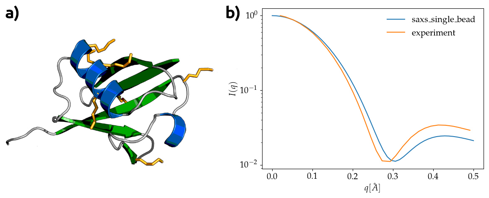

saxs_single_bead documentation
==================================

.. toctree::
   :hidden:
   :maxdepth: 1

saxs-single-bead is all Python package to compute small angle X-ray scattering (SAXS) profiles in one-bead-per-residue approximation with numpy

How to install
''''''''''''''

.. prompt:: bash $ auto

  $ python3 -m pip install saxs_single_bead

and you'll be good to go.

Example usage
'''''''''''''

Obtain approximate SAXS scattering curve for ubiquitin (1ubq) from locations of Cα atoms.

**Figure 1:** **a)** Cartoon of ubiquitin (1ubq) created by Rogerdodd (2008) CC-BY-SA, **b)** Approximate SAXS curve computed using **saxs_single_bead** package.

Package contents
''''''''''''''''

.. automodule:: saxs_single_bead.scattering_curve
   :members:

.. automodule:: saxs_single_bead.form_factors
   :members:
   
   
Algorithm concept
'''''''''''''''''

Dudu Tong, Sichun Yang, Lanyuan Lu *Accurate optimization of amino acid form factors for computing small-angle X-ray scattering intensity of atomistic protein structures*; J Appl Crystalogr (2016)
